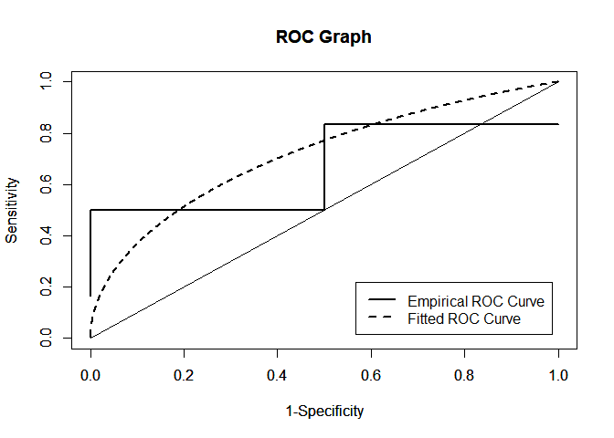

<!-- README.md is generated from README.Rmd. Please edit that file -->

# PLindleyROC

<!-- badges: start -->

[](https://github.com/ErtanSU/PLindleyROC/actions/workflows/R-CMD-check.yaml)
[](https://app.codecov.io/gh/ErtanSU/PLindleyROC)
[](https://cran.r-project.org/package=PLindleyROC)
[](https://www.gnu.org/licenses/gpl-3.0.en.html)
[](https://github.com/ErtanSU/PLindleyROC)
<!-- badges: end -->

The goal of PLindleyROC is to evaluate the Receiver Operating
Characteristic (ROC) for Power Lindley Distribution. Additionally, The
performace asssesments can be performed associated with the Bi-Power
Lindley ROC model.

## Installation

You can install the development version of PLindleyROC via the following
code:

``` r
# install.packages("devtools")
devtools::install_github("ErtanSU/PLindleyROC")
```

## Example

This is a basic example which shows you how to solve a common problem:

``` r
library(PLindleyROC)
dPLD(c(1,2,3,4,5,200),alpha=3,beta=2)
#> [1]  1.082682e+00  1.620507e-05  3.560890e-21  1.070039e-52 3.363180e-105
#> [6]  0.000000e+00
```

``` r
library(PLindleyROC)
pPLD(c(.5,1,2,3,4),alpha=3,beta=2)
#> [1] 0.1562992 0.7744412 0.9999993 1.0000000 1.0000000
```

``` r
library(PLindleyROC)
qPLD(c(.9971,0.5,0.3),alpha=3,beta=2)
#> [1] 1.5220612 0.7868721 0.6362570
```

``` r
library(PLindleyROC)
rPLD(10,alpha=3,beta=2)
#>  [1] 0.2727832 1.2392219 0.7699234 0.4779818 0.8165381 0.4798310 0.9760771
#>  [8] 1.1943763 0.7794092 1.1113773
```

``` r
library(PLindleyROC)
r.pl_auc(x=c(1,2,2,3,1),y=c(1,3,2,4,2,3),true_param=c(alpha1=1,beta1=1,alpha2=1,beta2=1),method=c("TRUE"))
#> [1] 0.5
```

``` r
library(PLindleyROC)
r.pl_index(x=c(1,2,2,3,1),y=c(1,3,2,4,2,3),init_param=c(1,1,1,1),init_index=1,method=c("MLE"))
#>    Cut-off Point Sensitivity Specificity 1-Specificity
#> J       2.257651   0.5843951   0.7345488     0.2654512
#> ER      2.128638   0.6365278   0.6790223     0.3209777
#> CZ      2.155423   0.6258267   0.6909883     0.3090117
#> EC      2.049502   0.6676484   0.6424604     0.3575396
```

``` r
library(PLindleyROC)
x=c(1,2,2,3,1)
y=c(1,3,2,4,2,3)
r.pl_graph(x,y,init_param=c(1,1,1,1),empirical=TRUE,method=c("MLE"))
```



## Corresponding Author

Department of Statistics, Faculty of Science, Selcuk University, 42250,
Konya, Turkey <br />

Email:<https://www.researchgate.net/profile/Ertan-Akgenc>

## References

Akgenç, E., and Kuş, C., 2023, *ROC Curve Analysis for the Measurements
Distributed Power-Lindley Distribution*, 2nd International E-Conference
On Mathematical And Statistical Sciences: A Selçuk Meeting
(ICOMSS-2023), Konya, 25.

Attwood, K., Hou, S., and Hutson, A., 2022, *Application of the skew
exponential power distribution to ROC curves*, Journal of Applied
Statistics, 1-16.

Ghitany M., Al-Mutairi D. K., Balakrishnan N., and Al-Enezi L., 2013,
*Power lindley distribution and associated inference*, Computational
Statistics & Data Analysis, 64,20–33.

Liu, X., 2012, *Classification accuracy and cut point selection*,
Statistics in medicine, 31(23), 2676-2686.

Nahm, F. S., 2022, *Receiver operating characteristic curve: overview
and practical use for clinicians*, Korean journal of anesthesiology,
75(1), 25-36.

Perkins, N. J., and Schisterman, E. F., 2006, *The inconsistency of
“optimal” cutpoints obtained using two criteria based on the receiver
operating characteristic curve*, American journal of epidemiology,
163(7), 670-675.

Pundir, S. and Amala, R., 2014, *Evaluation of area under the constant
shape bi-weibull roc curve*, Journal of Modern Applied Statistical
Methods, 13(1),1-20.

Youden, W. J., 1950, *Index for rating diagnostic tests*, Cancer, 3(1),
32-35.
